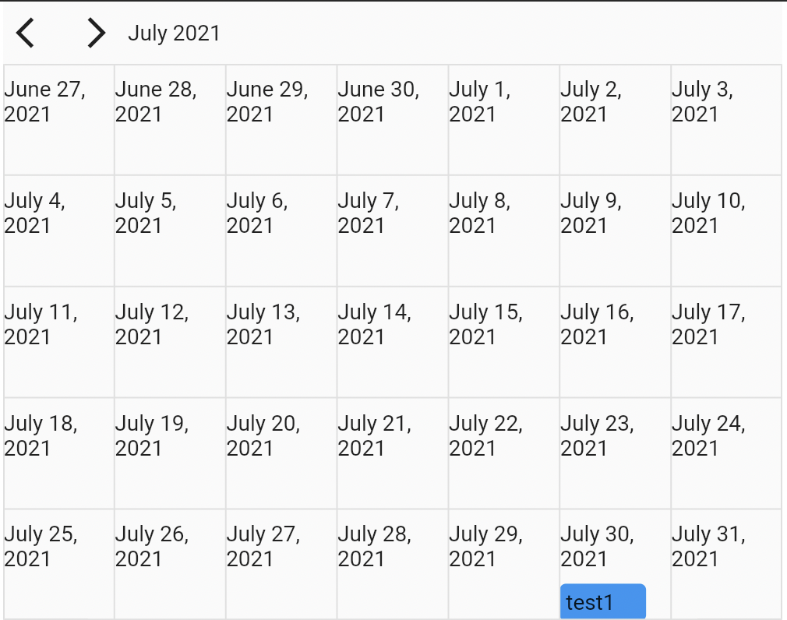

# Calendar Plus

A highly customizable calendar template for Flutter. You have complete control over the widgets built inside the calendar. 
See examples for example implementations of events drag and drop.

## Getting started

In the `pubspec.yaml` of your flutter project, add the following dependency:

```yaml
dependencies:
  ...
  calendar_plus: <latest_version>
```

In your library add the following import:

```dart
import 'package:calendar_plus/calendar_plus.dart';
```

## Example



```dart
    CalendarPlus(
      displayRowCount: 10,
      controller: controller,
      cellBuilder: (context, date) {
        return Material(
          shape: CircleBorder(),
          color: isSameDay(date)
              ? Colors.blue
              : Colors.transparent,
          child: InkWell(
            hoverColor: Colors.grey.shade200,
            customBorder: CircleBorder(),
            onTap: () {},
            child: Center(
              child: Text(date.toString()),
            ),
          ),
        );
      },
    );
```

## Authors

- [@lucasbstn](https://www.github.com/lucasbstn)

## Contributing

- Contributions are welcome!
- If you want to contribute code please create a PR
- If you find a bug or want a feature, please fill an issue
